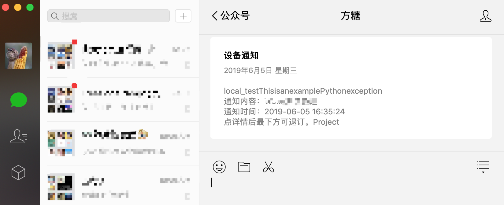

# sentry-pushbear

这是用 [pushbear](http://pushbear.ftqq.com) 给[微信](https://weixin.qq.com)发消息的一个 [Sentry](https://github.com/getsentry/sentry) 插件


> 什么是 pushbear？先看看 [Server酱](http://sc.ftqq.com/3.version) 吧

## 用起来是什么样子的？

当 Sentry 发一个提醒时，会以微信公众号（服务号）的形式发送一条提醒：



打开后的样子是：


## 安装

1. 装这个包
    * Python 方式安装的话
        ```
        pip install sentry-pushbear
        ```
    * Docker 方式安装的话
    
        把 `sentry-pushbear` 加到你的 [requirements.txt](https://github.com/getsentry/onpremise/blob/master/requirements.txt) 文件中
        
2. 重启你的应用

3. 打开 Sentry 网页，找到你要添加的项目，打开配置页

4. 在 Integrations (或者 Legacy Integrations)页面，找到 PushBear Notifications 插件并开启

5. 配置插件，在[这里](http://pushbear.ftqq.com)查看如何生成 SendKey

6. 完成！
