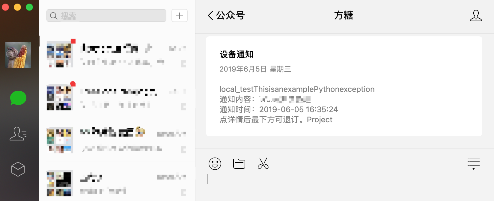
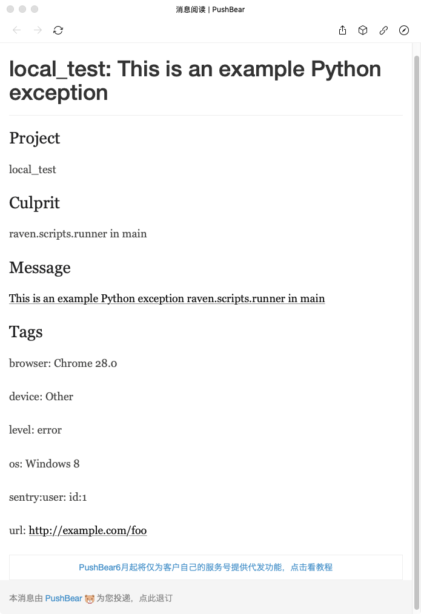

# sentry-pushbear

A [Sentry](https://github.com/getsentry/sentry) plugin that integrates with [pushbear](http://pushbear.ftqq.com/admin/#/) to send to [WeChat](https://weixin.qq.com/)

> What is pushbear? See [ServerChan](http://sc.ftqq.com/3.version)

## How will it looks like

When sentry push a notify:



When we open it:



## Installation

1. Install this package
    * Install with Python
        ```
        pip install sentry-pushbear
        ```
    * Install with Docker
    
        Add `sentry-pushbear` to your [requirements.txt](https://github.com/getsentry/onpremise/blob/master/requirements.txt)
        
2. Restart your Sentry instance.

3. Go to your Sentry web interface. Open Settings page of one of your projects.

4. On Integrations (or Legacy Integrations) page, find PushBear Notifications plugin and enable it.

5. Configure plugin on Configure plugin page.

    See [here](http://pushbear.ftqq.com) to know how to create SendKey.

6. Done!

